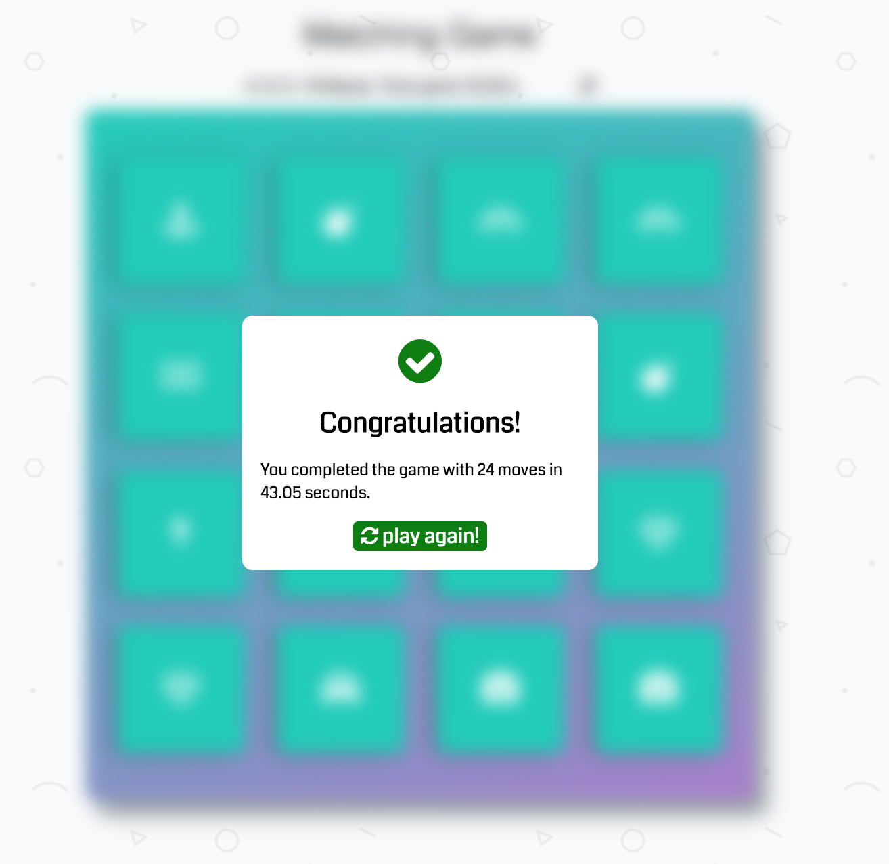

# Flip Card Game

**Author**: Shuchen Liu

## Introduction

A basic match-and-win game that sports a move/time counter.

###Game Start
A game will automatically start as the clock kicks off. The rule is to find all 8 pair of cards that share the same icon.  Click on a card to flip it and to reveal the icon it bears.

### A matched pair
If a valid pair is found, the cards will be locked faced-up. If two cards clicked do not have the same icon, they both will flip back to face-down.

### Winning message
Try to solve the puzzle as quick as possible with fewest moves! Your result will be displayed on the pop-up and you can always click on the replay button to start a new game.

### Dependency
[Udacity Memory Game](https://github.com/udacity/fend-project-memory-game)